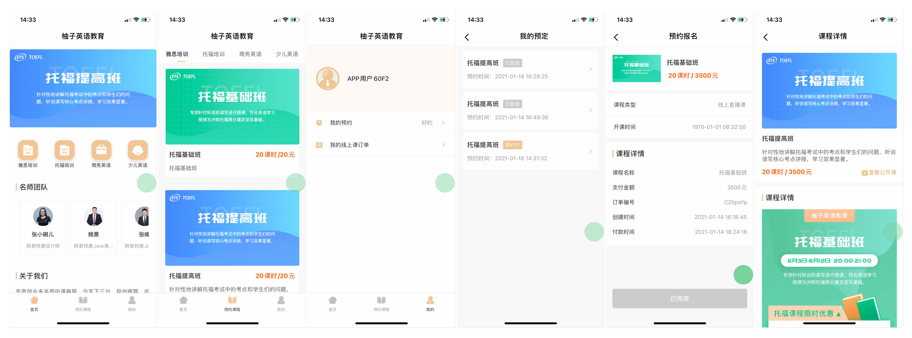
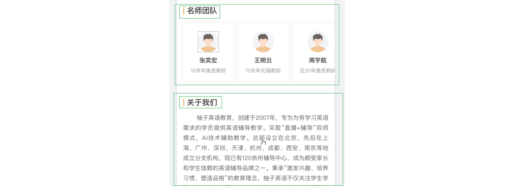
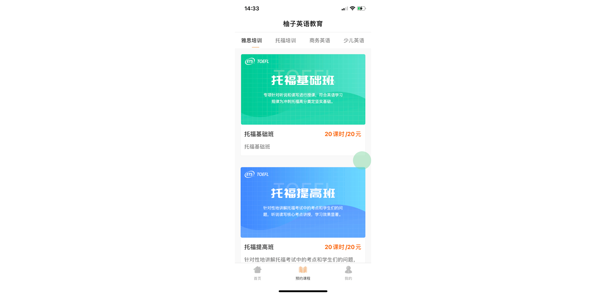
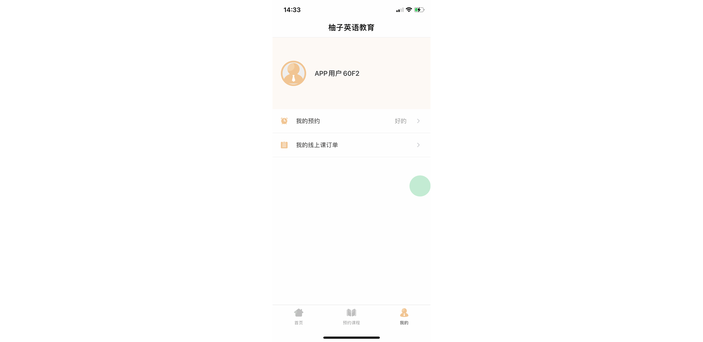

# ` 深度解析 ` 教育培训(education-training) 模板项目

## 简介

本项目的一个教育培训服务APP。提供在线浏览机构信息、名师风采和课程预约订购等功能。

项目前端使用了 [` avm.js ` 多端开发技术](https://docs.apicloud.com/apicloud3?uzchannel=30) ，可同时编译为 ` Android `  &  ` iOS `   ` App `
以及微信小程序； 后端使用 ` APICloud ` [数据云3.0](https://docs.apicloud.com/Cloud-API/sentosa?uzchannel=30) 云函数自定义接口。

### 技术要点

本项目在开发过程中，在“能拆就拆”的思想下，对项目进行细粒度的组件化拆解。 可以从中了解到组件拆分逻辑和一些操作技巧，对自定义组件进行巩固。

### 效果图

### 源码目录结构介绍

项目源码在本仓库的  ` widget ` 目录下。其中该目录下的文件结构如下：

~~~ js 
┌─component/                    // 项目公共组件目录
│  ├─img/                       // 组件公用素材
│  ├─a-card.stml                // [基础组件]卡片组件
│  ├─a-cell.stml                // [基础组件]单元格组件
│  ├─a-cell-group.stml          // [基础组件]单元格容器组件
│  ├─a-header.stml              // [基础组件]头部导航组件
│  ├─a-section.stml             // [基础组件]章节组件
│  ├─a-tab.stml                 // [基础组件]选项卡组件
│  ├─a-tabs.stml                // [基础组件]选项卡容器组件
│  ├─b-course.stml              // [业务组件]课程详情组件
│  ├─b-notice.stml              // [业务组件]提醒面板组件
│  ├─c-course-list.stml         // [组合组件]课程列表页
├─images/                       // 图片素材图标资源目录
├─pages/                        // 新版的AVM页面目录
│  ├─course-detail/
│  │  └─course-detail.stml      // 课程详情页
│  ├─course-list/
│  │  └─course-list.stml        // 课程列表页
│  ├─course-pay/
│  │  └─course-pay.stml         // 购买课程页
│  ├─course-preorder/
│  │  └─course-preorder.stml    // 预约课程页
│  ├─order-detail/
│  │  └─order-detail.stml       // 用户订单详情页
│  ├─order-list/
│  │  └─order-list.stml         // 用户订单列表页
│  ├─pay-result/
│  │  └─pay-result.stml         // 下单(支付)结果页
│  ├─play-video/
│  │  └─play-video.stml         // 视频播放页
│  ├─preorder-detail/
│  │  └─preorder-detail.stml    // 用户预约详情页
│  ├─preorder-list/
│  │  └─preorder-list.stml      // 用户预约列表页
│  ├─tab-home/
│  │  └─tab-home.stml           // tab页-0 入口主页
│  ├─tab-course/
│  │  └─tab-course.stml         // tab页-1 课程分类列表
│  ├─tab-user/
│  │  └─tab-user.stml           // tab页-2 用户主页
├─script/                       // JavaScript脚本目录
│  ├─UserManager.js             // 用户数据管理类
│  └─req.js                     // 项目请求交互文件
└─config.xml                    // 应用配置文件
~~~

## 开发详情

### TabBar 的组织

如果有留意到 ` APICloud ` 官方的  ` github `
上前几个模板项目源码的同学们已经对 ` TabBar ` 的实现很熟悉了。

通过在项目根目录下定义 ` app.json ` 来创建一个 ` Tabbar ` 的主页结构。 在这个文件中，可以定义一些主页结构的具体参数。 包括每个 ` Tab ` 页面的路径、名称和底部导航图标资源信息。

如果需要适配小程序的原生 ` Tabbar ` 结构，这将是最佳的选择。 如果项目没有小程序的适配计划，也可以使用原有的  ` FrameGroup ` 来更加深度自定义相关切换行为和逻辑。

### 网络请求 req.js

一般项目的数据都是需要和服务器进行通讯获得。通过本地请求库拿到相关数据并进行处理和渲染到界面。 为了统一方便进行请求（会话、缓存和异常等），将在 ` req.js ` 中来处理相应的逻辑。
具体封装方式和实现可以根据个人团队喜好或者是接口通讯规则来开发，本项目中的逻辑仅供参考。

### tab页-0 入口主页

主页结构非常简单，分为四个部分。

0. 头部导航栏
1. 头部轮播图
2. 中部分类滑动栏
3. 下部名师卡片滑动栏
4. 底部  ` 关于我们 `  富文本

#### 自定义组件：a-header 头部导航栏

头部的导航栏很容易被忽视。这里我们自定义了一个 ` a-header ` 基础组件。具体实现是在 ` components/a-header.stml `中。

在这个组件中， ` template ` 部分定义了具体的 ` UI ` 结构。

~~~html

<template>
    (isApp() &&
    <safe-area class="a-header">
        ...
    </safe-area>
    )
</template>
~~~

其中  ` ( condition && <tag />)  ` 这种书写方式可以用来实现 ` v-if ` 的效果。
` condition ` 就是一个布尔值，具体求值是来自一个函数。 因为小程序和 ` WEB ` 中不需要这个头部，只有 ` APP `端才需要渲染。 可以在相关函数中定义具体的渲染依据，实现“条件渲染”的效果。

` a-header ` 组件的职责就是为了显示头部导航栏，最重要的要素就是“标题”文本、左右侧的按钮和事件。

通过自定义参数 ` title ` 和  ` leftIcon ` 等传入相关配置。进而在模板中获值渲染。 还有一些场景参数，通过对 ` leftIcon ` 的不同类型和取值来实现是否需要返回按钮的实现。

在组件的方法中有两个点击事件：

~~~js
  methods: {
    onClickLeft()
    {
        if (this.props.onClickLeft) {
            this.props.onClickLeft();
        } else {
            api.closeWin();
        }
    }
,
    onClickRight()
    {
        this.props.onClickRight && this.props.onClickRight();
    }
}
~~~

这两个方法用于响应头部导航栏的左右点击。 左侧点击有一个内部判断：看看是否有传入自定义事件，有的话，执行传入的事件； 反之，执行默认逻辑：关闭窗口。

右侧点击的事件没有默认逻辑，只需要判断是否自定义右侧逻辑即可。

#### 头部幻灯片

头部导航的图片信息来自网络请求数据：

~~~js
function getHomeData() {
    GET('i_alls/home').then(data => {
        this.data.homeData = data;
        api.setPrefs({
            key: 'course_category', value: data.course_category
        });
    })
}
~~~

获取到数据以后使用一个 ` swiper ` 组件来展示这个轮播图：

~~~html 
 <swiper autoplay circular class="main__swiper" style="margin: 10px 0;"
              v-if="homeData.banners">
        <swiper-item v-for="(item,index) in homeData.banners" class="main__swiper--item">
          
        </swiper-item>
 </swiper>
~~~

使用可以滚动的 ` scroll-view ` 组件来渲染分类菜单和名师团队两处结构：

~~~html

<scroll-view class="main__menu" scroll-x v-if="homeData.course_category"
             :style="'height:'+(api.winWidth/4+20)+'px;'">
    <view class="main__menu--item" v-for="item in homeData.course_category" @click="goto(item)"
          :style="'width:'+api.winWidth/4+'px;'">
        
        <text class="main__menu--item-text">{{ item.name }}</text>
    </view>
</scroll-view>

<a-section title="名师团队" v-if="homeData.teacher_teams" class="main__teachers">
    <scroll-view class="main__teacher" scroll-x>
        <view class="main__teacher--item" v-for="item in homeData.teacher_teams" @click="test">
            
            <text class="main__teacher--item-name">{{ item.name }}</text>
            <text class="main__teacher--item-introduction">{{ item.introduction }}</text>
        </view>
    </scroll-view>
</a-section>
~~~

#### 自定义组件：a-section 章节组件

通过整体审视项目设计稿，发现项目中存在大量的重复元素，来强化章节部分的概念。 由于这类重复出现且行为统一的部分，就需要考虑整理归纳成组件。 归纳出来便于维护和提高代码复用性，在结构复杂的大型项目下显得尤为有效。

~~~html

<template>
    extendsClassStyleEvents.call(this,
    <view class="a-section">
        {this.props.title &&
        <view class="a-section__header">
            <view class="a-section__header--solid"></view>
            <text class="a-section__header--text">{this.props.title}</text>
        </view>
        }
        <view class="a-section__content">
            {this.props.children}
        </view>
    </view>
    )
</template>
~~~

实际上模板也可以使用自定义函数来包裹起来，来实现一些自定义行为处理。 例如上面的 ` extendsClassStyleEvents ` ：

~~~js 
/**
 * 继承父组件的 class 、style 和 on事件
 * @param VNode
 * @returns {*}
 */
function extendsClassStyleEvents(VNode) {
    this.props.class && (VNode.attributes.class += ' ' + this.props.class);
    this.props.style && (VNode.attributes.style = this.props.style);
    Object.values(this.props).filter(item => typeof item === 'function' && item.name.startsWith('on')).forEach(ev => VNode.attributes[ev.name] = ev);
    return VNode;
}
~~~

值得一提的是，该组件中使用了一个 ` {this.props.children} ` 的片段， 也可以看做是传值的一种，但这个值不是来自于属性，而是 ` 双标签 ` 的内部内容，适合传递模板类参数。

#### “关于我们” 的富文本渲染

首页上的“关于我们”这一节是使用的富文本组件： ` rich-text ` 。使用方法很简单，传入 ` nodes ` 节点即可。

~~~html

<a-section title="关于我们" v-if="homeData.aboutus" class="main__about">
    <text class="main__about--text">{{ homeData.aboutus[0].value }}</text>
</a-section>
~~~

### tab页-1 课程列表

#### 页面级复用 c-course-list

经过观察项目，存在两个高度相似的页面：
` tab-1 ` 的课程列表和从 ` tab-0 `首页点击分类进去的页面是很相似的结构。甚至可以看做是同一页面的不同场景打开。 在之前的 ` APICloud 1.0` 版本中，我们可以直接使用同一个 ` html `
文件来打开不同的页面。 但是在当前项目下，有一个页面是作为主页  ` TabBar ` 页面之一来打开的，只写一个页面不能实现。

这时候，又的确遇到页面一致的情况，直接复制文件肯定是可以实现的。但是需要维护两处，肯定是不够优雅的。

所以可以考虑将整个页面提取出来到组件 ` c-course-list ` 中，然后分别在不同的路由页面中去调用即可。

#### 自定义可切换的tab栏

在设计 ` tab ` 组件的时候，我们可以先将使用的结构模拟出来，相当于是做一个组件结构设计草图：

~~~html

<a-tabs>
    <a-tab title="tab名称1"></a-tab>
    <a-tab title="tab名称2"></a-tab>
    <a-tab title="tab名称3"></a-tab>
</a-tabs>
~~~

然后再去创建一个组件文件，去具体实现。这个组件的特殊之处在于：使用了两层组件渲染。
` a-tabs ` 作为一个组件容器，用于接收参数，处理数据分发等。 每一个 ` tab ` 页是自定义一个 ` a-tab ` 子页来接收具体页面内容，和定义页面名称（ ` title ` ）。

下面是 ` a-tabs ` 界面模板部分：

~~~html

<template>
    extendsClassStyleEvents.call(this,
    <view class="a-tabs">
        <view class={mixedClass('a-tabs__nav',{'a-tabs__nav-scroll':this.scrollNav})}
              style="flex-flow: row nowrap;justify-content: space-around;height: 44px;align-items: center;flex-shrink: 0;">
            ...// 顶部导航
            <view class="a-tabs__nav--line" style={this.lineStyle}></view>
        </view>
        <swiper autoplay={false} circular={false} :current={this.props.param.current}
                onchange={this.handleSwiperChange} class="a-tabs__content">
            <swiper-item v-for="tab in this.props.children">
                <scroll-view scroll-y="true" class="a-tabs__content--scroll-view">
                    {tab}
                </scroll-view>
            </swiper-item>
        </swiper>
    </view>
    )
</template>
~~~

同样地，使用了 ` extendsClassStyleEvents ` 来继承事件、样式和 ` class `。 注意到第二个 ` view ` 标签的 ` class ` 用一个  ` mixedClass ` 函数来表示的。

~~~js
/**
 * 混合class类
 * @param cls
 * @param extra
 * @returns {string}
 */
function mixedClass(cls, extra) {
    let classList = [cls];
    Object.entries(extra).forEach(([key, val]) => val && classList.push(key));
    return classList.join(' ');
}
~~~

该函数是用来处理不同的条件所需要渲染不同的 ` class ` 的。当然，也可以在模板中写三元表达式来实现。

` a-tabs ` 的顶部栏目部分需要渲染出该组件内有多少个子级 ` a-tab `，用来渲染子级的 ` title `  。 并为其绑定点击事件 ` handleNavClick ` ，实现点击切换 ` tab ` ：

 ~~~html

<view class={mixedClass('a-tabs__nav--item',{'a-tabs__nav--item-scroll':this.scrollNav})}
      onClick={this.handleNavClick.bind(this,index)}
      v-for="(item,index) in this.props.children">
    <text :class="'a-tabs__nav-text'
            + (index===this.props.param.current?' a-tabs__nav-text---active':'')">
        {item.attributes.title}
    </text>
</view>
~~~

底部则对应使用一个 ` swiper ` 组件来处理具体页面的展示。 ` swiper ` 切换的时候，也就是改变了当前 ` tab ` 的页面显示， 需要将其通过事件 ` handleSwiperChange `
反馈到业务中，实现数据状态同步。

~~~html

<swiper autoplay={false} circular={false} :current={this.props.param.current}
        onchange={this.handleSwiperChange} class="a-tabs__content">
    <swiper-item v-for="tab in this.props.children">
        <scroll-view scroll-y="true" class="a-tabs__content--scroll-view">
            {tab}
        </scroll-view>
    </swiper-item>
</swiper>
~~~

### tab-2 用户主页

用户主页结构也很简单：

1. 用户信息面板
2. 用户操作菜单

#### 用户数据处理

上面的用户信息面板是使用了一个 ` view ` 结合  ` v-if ` 判断用户信息是否登录：

~~~html

<view class="user-panel" v-if="userData" @click="logout">
    
    <text class="user-name">{{ userData.name }}</text>
</view>
<view class="user-panel" v-else @click="doLogin">
    
    <text class="user-name">请登录</text>
</view>
~~~

而  ` userData ` 来自于数据域中：

~~~js
this.UM = new UserManager();
this.data.userData = this.UM.data;
~~~

代码中的 ` UserManager `是一个用户数据管理类。通过封装数据存储的形式来统一管理用户数据行为。

~~~js
export default class UserManager {
    userDataKey = 'USER-DATA';

    get data() {
        const userData = api.getPrefs({
            key: this.userDataKey,
            sync: true
        })

        if (userData) {
            return JSON.parse(userData);
        }
        return null;
    }

    set data(value) {
        api.setPrefs({
            key: this.userDataKey,
            value
        })
    }

    logout() {
        api.removePrefs({
            key: this.userDataKey
        });
        return this._data;
    }

}
~~~

另外，也可以使用  ` Object.defineProperty `  来实现一个数据拦截，保存到本地偏好数据。 更进一步还可以使用` Proxy ` 和 ` Reflect ` 来实现观察者模式，配合广播事件等，让用户数据更加智能。

#### 用户菜单 cell 单元格组件

下面的用户菜单是非常常见的一个单元格结构。

~~~html
<a-cell title="我的预约" value="好的" link="preorder-list"
        imgIcon="../../images/icon__user-cell--alarm.png"/>

<a-cell title="我的线上课订单"
        link="../order-list/order-list.stml"
        imgIcon="../../images/icon__user-cell--order.png"/>
~~~

单元格肩负项目名称、项目值、图标和点击跳转等功能。
~~~html
<template>
  extendsClassStyleEvents.call(this,
  <view class={mixedClass('a-cell__root',{['a-cell__root--type-'+(this.props.type||'default')]:true})}
        onclick={this.handleCellClick}>
    <view class="a-cell">
      {this.props.imgIcon&&}
      <view class={mixedClass('a-cell__main',{['a-cell__main--type-'+(this.props.type||'default')]:true})}>
        <text class="a-cell__title--text-title">{this.props.title}</text>
        <text class="a-cell__title--text-value">{this.props.value}</text>
      </view>
      {this.props.link&&}
    </view>

    {this.props.children.length!==0 &&
    <view class="a-cell__content">
      {this.props.children}
    </view>
    }

  </view>
  )
</template>
~~~

在模板中，有大量的条件判断：
- 根据 ` this.props.imgIcon  ` 的有无，来决定是否渲染项目图标；
- 根据 ` this.props.link  ` 的有无，来决定是否渲染右侧的链接小箭头；
- 根据  ` this.props.children.length ` 的子级长度来判断是否需要子容器来显示内部内容。

同时，为其绑定一个  ` handleCellClick ` 点击事件来处理  ` this.props.link ` 传来的跳转路由行为：

~~~js
function handleCellClick(ev) {
      if (this.props.link) {
        let options = {};
        if (typeof this.props.link === 'string') {
          if (this.props.link.endsWith('.stml')) {
            options.name = this.props.link.split('/').pop().replace('.stml', '');
            options.url = this.props.link;
          } else {
            options.name = this.props.link;
            options.url = `../${this.props.link}/${this.props.link}.stml`;
          }
        } else {
          options = this.props.link;
        }
        console.log(['a-cell:link', JSON.stringify(options)]);
        api.openWin(options);
      } else if (this.props.onClick) {
        this.props.onClick(ev);
      }
    }
~~~

这段代码分别处理了 ` this.props.link  ` 的取值的各种情况。能让其支持完整的同 ` api.openWin `的对象参数。
也可以支持带有 ` stml ` 的自定义路径参数。大多情况下，遵从项目结构规范，页面都在 ` pages ` 下的二级目录中，
所以还可以简化成一个字符串：让他既作为页面名称，也可以作为路径寻址参数，提高组件使用便捷性。

### 其他的二级页面
// TODO 
其他的二级页面和主页的组件和结构组织方式大同小异。具体可以参考项目源代码进行学习研究。

## 总结和反馈
本项目更多的是为大家展现了
- 组件的高级使用方法：诸如使用条件渲染、引入自定义函数对模板节点进行处理和继承，以及特殊节点 ` children ` 等使用 。
- 组件的设计流程：例如实现 ` a-tabs ` ，对于复杂的组件可以先定义使用外观，然后反向填充细节逻辑。
- 组件的设计原则：多出重复的页面结构就需要考虑提炼和归纳。设计出来的组件需要易用、简洁。否则会因为组件而导致理解沟通使用成本增加。

### 联系我们

如果您在使用过程中遇到了问题，直接提出 ` issue `，或者有更多的宝贵意见，欢迎到 ` APICloud ` 社区和 ` QQ ` 群与我们进行互动讨论。

官方技术交流群： ` 339762594 `

官方社区：[https://community.apicloud.com/](https://community.apicloud.com/?uzchannel=30)

### 其它

感谢关注本项目，如果觉得对您有帮助，希望给个  ` Star `  鼓励一下。

如需进一步了解技术细节和实现，请参阅  ` docs `  目录下的[《源码解析文档》](https://github.com/apicloudcom/education-training/tree/main/docs)。

## License

MIT © [APICloud](https://www.apicloud.com/?uzchannel=30)